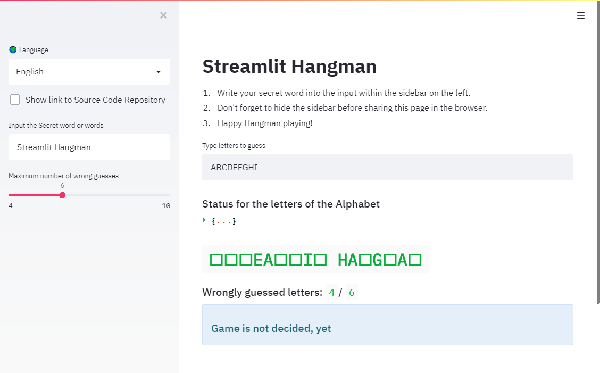

# Streamlit Hangman



**Hangman** implementation with browser interface for use in _streams_ / _video conferences_ using the **Streamlit** library (<https://www.streamlit.io>)

## [✨ Live Web Application](https://schorfma-hangman.streamlit.app/)

## Installation

Python > 3.9.7, < 3.12 is required

```sh
poetry install
```

## Usage

```sh
poetry shell
streamlit run streamlit_hangman.py
```

The page should open in your default browser.

The language (`English` or `German` available) can be selected in the sidebar on the left.
